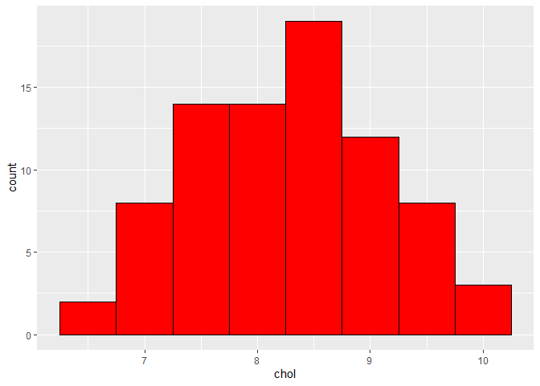
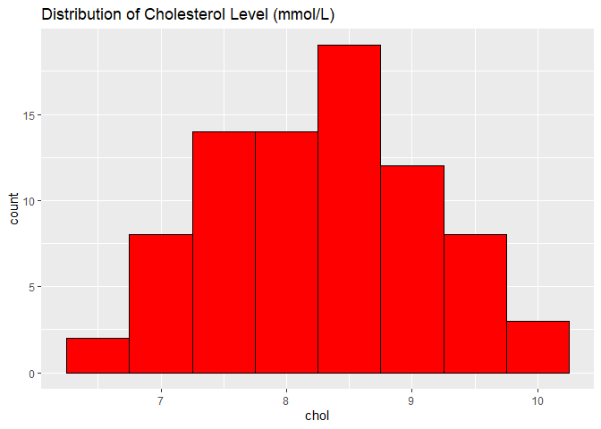
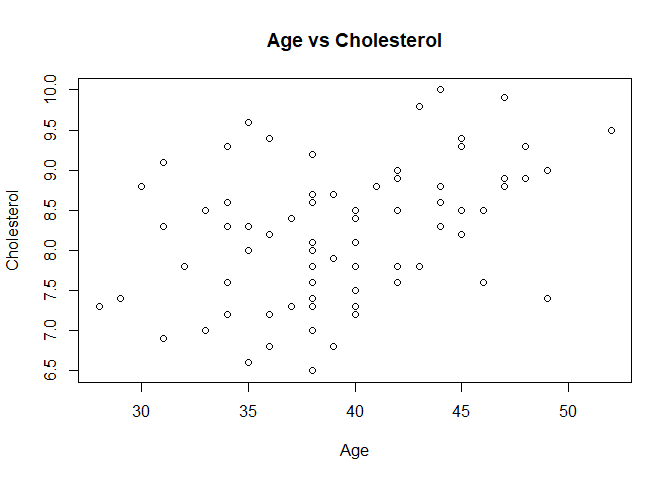
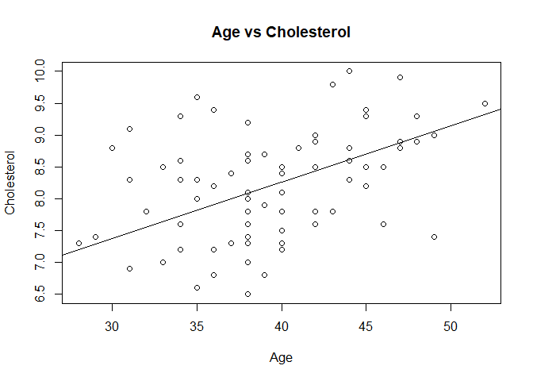
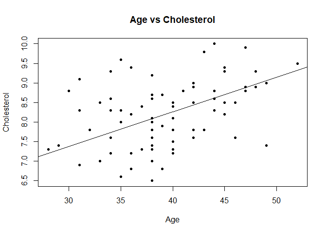

library(readxl)

```r
library(readxl)
library(dplyr)
```

```
## 
## Attaching package: 'dplyr'
```

```
## The following objects are masked from 'package:stats':
## 
##     filter, lag
```

```
## The following objects are masked from 'package:base':
## 
##     intersect, setdiff, setequal, union
```

```r
Chol <- read_excel("cholest.xls")
```


```r
head(Chol)
```

```
## # A tibble: 6 × 5
##    chol   age exercise   sex categ
##   <dbl> <dbl>    <dbl> <dbl> <dbl>
## 1   6.5    38        6     1     0
## 2   6.6    35        5     1     0
## 3   6.8    39        6     1     0
## 4   6.8    36        5     1     0
## 5   6.9    31        4     1     0
## 6   7      38        4     1     0
```


```r
str(Chol)
```

```
## tibble [80 × 5] (S3: tbl_df/tbl/data.frame)
##  $ chol    : num [1:80] 6.5 6.6 6.8 6.8 6.9 7 7 7.2 7.2 7.2 ...
##  $ age     : num [1:80] 38 35 39 36 31 38 33 36 40 34 ...
##  $ exercise: num [1:80] 6 5 6 5 4 4 5 5 4 6 ...
##  $ sex     : num [1:80] 1 1 1 1 1 1 1 1 1 1 ...
##  $ categ   : num [1:80] 0 0 0 0 0 0 0 0 0 0 ...
```


```r
chol_1 <- Chol %>% 
  mutate(sex = factor(sex, labels = c("male", "female")),
         categ = factor(categ, labels = c("Grp A", "Grp B", "Grp C")))
```


```r
str(chol_1)
```

```
## tibble [80 × 5] (S3: tbl_df/tbl/data.frame)
##  $ chol    : num [1:80] 6.5 6.6 6.8 6.8 6.9 7 7 7.2 7.2 7.2 ...
##  $ age     : num [1:80] 38 35 39 36 31 38 33 36 40 34 ...
##  $ exercise: num [1:80] 6 5 6 5 4 4 5 5 4 6 ...
##  $ sex     : Factor w/ 2 levels "male","female": 2 2 2 2 2 2 2 2 2 2 ...
##  $ categ   : Factor w/ 3 levels "Grp A","Grp B",..: 1 1 1 1 1 1 1 1 1 1 ...
```


```r
chol_1 $age
```

```
##  [1] 38 35 39 36 31 38 33 36 40 34 38 40 40 28 37 38 49 29 40 38 34 46 42 38 32
## [26] 43 42 40 38 39 39 39 35 38 40 38 45 36 31 34 44 35 40 37 33 46 42 40 45 42
## [51] 45 38 34 44 39 38 39 47 41 44 30 48 47 42 42 49 31 38 38 48 34 45 45 36 45
## [76] 52 35 43 47 44
```


```r
summary(chol_1)
```

```
##       chol            age           exercise         sex       categ   
##  Min.   : 6.50   Min.   :28.00   Min.   :2.000   male  :40   Grp A:25  
##  1st Qu.: 7.60   1st Qu.:36.00   1st Qu.:4.000   female:40   Grp B:33  
##  Median : 8.30   Median :39.00   Median :4.000               Grp C:22  
##  Mean   : 8.23   Mean   :39.48   Mean   :4.225                         
##  3rd Qu.: 8.80   3rd Qu.:43.25   3rd Qu.:5.000                         
##  Max.   :10.00   Max.   :52.00   Max.   :6.000
```

```r
mean (chol_1 $ age)
```

```
## [1] 39.475
```


```r
sd (chol_1 $age)
```

```
## [1] 5.128661
```

```r
median(chol_1 $age)
```

```
## [1] 39
```


```r
summary(chol_1 $ sex)
```

```
##   male female 
##     40     40
```

```r
table(chol_1 $ sex)
```

```
## 
##   male female 
##     40     40
```


```r
prop.table(table(chol_1 $ categ)) *100
```

```
## 
## Grp A Grp B Grp C 
## 31.25 41.25 27.50
```

```r
cbind(count = table(chol_1 $categ),
"%" = prop.table(table(chol_1 $ categ)) *100)
```

```
##       count     %
## Grp A    25 31.25
## Grp B    33 41.25
## Grp C    22 27.50
```


```r
library(ggplot2)
```


```r
ggplot(chol_1, aes(x = chol)) +
  geom_histogram(binwidth = 0.5,
                 colour = "black", fill = "red")
```

<!-- -->


```r
ggplot(chol_1, aes(x = chol)) +
  geom_histogram(binwidth = 0.5,
                 colour = "black", fill = "red") +
  ggtitle("Distribution of Cholesterol Level (mmol/L)")
```

<!-- -->


```r
plot (chol_1 $ age, chol_1 $ chol, main = "Age vs Cholesterol",
      xlab = "Age", ylab = "Cholesterol")
```

<!-- -->


```r
plot (chol_1 $ age, chol_1 $ chol, main = "Age vs Cholesterol",
      xlab = "Age", ylab = "Cholesterol")
abline(line(chol_1 $ age, chol_1 $ chol))
```

<!-- -->


```r
plot (chol_1 $ age, chol_1 $ chol, main = "Age vs Cholesterol",
      xlab = "Age", ylab = "Cholesterol", pch = 20)
abline(line(chol_1 $ age, chol_1 $ chol))
```

<!-- -->

